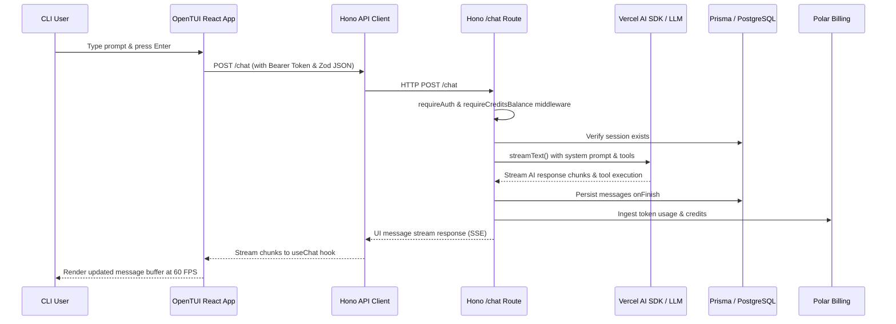

# Nightcode 🚀 — Deep Code-Level Architecture & Reverse-Engineering Reference

> **Technical Textbook & System Design Specification**  
> *Target Monorepo: `nightcode` (Bun, React, OpenTUI, Hono, Prisma, PostgreSQL, Clerk, Polar)*

---

## 📑 Table of Contents

1. [Project Overview](#1-project-overview)
2. [Repository Structure & Workspace Packages](#2-repository-structure--workspace-packages)
3. [Application Entrypoints & Startup Sequence](#3-application-entrypoints--startup-sequence)
4. [Dependency & Package Map](#4-dependency--package-map)
5. [CLI / TUI Architecture & React Rendering](#5-cli--tui-architecture--react-rendering)
6. [Command System & Slash Command Handlers](#6-command-system--slash-command-handlers)
7. [Authentication Architecture: OAuth 2.0 with PKCE](#7-authentication-architecture-oauth-20-with-pkce)
8. [API Architecture & Hono Routes](#8-api-architecture--hono-routes)
9. [Middleware Layer (`requireAuth` & `requireCreditsBalance`)](#9-middleware-layer-requireauth--requirecreditsbalance)
10. [AI Chat Architecture & Streaming Flow](#10-ai-chat-architecture--streaming-flow)
11. [Vercel AI SDK Integration & Model Resolution](#11-vercel-ai-sdk-integration--model-resolution)
12. [System Prompts & Mode Switching (`PLAN` vs `BUILD`)](#12-system-prompts--mode-switching-plan-vs-build)
13. [Tool Calling & Local Filesystem/Shell Execution](#13-tool-calling--local-filesystemshell-execution)
14. [Database Schema & Session/Message Persistence (Prisma + PostgreSQL)](#14-database-schema--sessionmessage-persistence-prisma--postgresql)
15. [Billing, Usage Metering & Credit System (Polar)](#15-billing-usage-metering--credit-system-polar)
16. [Error Handling & Sentry Instrumentation](#16-error-handling--sentry-instrumentation)
17. [Security Analysis & Risk Assessment](#17-security-analysis--risk-assessment)
18. [Complete System Architecture & Sequence Diagrams](#18-complete-system-architecture--sequence-diagrams)
19. [End-to-End Request Trace: "Fixing a File"](#19-end-to-end-request-trace-fixing-a-file)
20. [File-by-File Core Reference Guide](#20-file-by-file-core-reference-guide)
21. [Architectural "Why" Analysis](#21-architectural-why-analysis)
22. [Debugging Playbook](#22-debugging-playbook)
23. [Interview Preparation & Q&A](#23-interview-preparation--qa)
24. [Mental Model & 30-Second Elevator Pitch](#24-mental-model--30-second-elevator-pitch)

---

## 1. Project Overview

**Nightcode** is an interactive, terminal-native AI coding assistant and developer workspace. It is structured as a Bun workspace monorepo (`packages/*`) consisting of a terminal user interface frontend (`@nightcode/cli`), an ultrafast backend API server (`@nightcode/server`), a relational database layer (`@nightcode/database`), and shared TypeScript contracts (`@nightcode/shared`).

---

## 2. Repository Structure & Workspace Packages

✅ **VERIFIED FROM SOURCE** (`package.json`, workspace definitions):
```
nightcode/
├── packages/
│   ├── cli/         # Terminal User Interface frontend (@nightcode/cli)
│   ├── server/      # Hono API backend & AI orchestration (@nightcode/server)
│   ├── database/    # Prisma ORM client & PostgreSQL schema (@nightcode/database)
│   └── shared/      # Shared Zod schemas, model definitions, tool contracts (@nightcode/shared)
├── package.json     # Workspace root configuration
└── bun.lock         # Bun lockfile
```

---

## 3. Application Entrypoints & Startup Sequence

### CLI Startup Flow
✅ **VERIFIED FROM SOURCE**:
1. Terminal invocation `nightcode` executes `packages/cli/bin/nightcode`.
2. Bun executes `packages/cli/src/index.tsx`.
3. React 19 renders `<ThemedRoot />` via OpenTUI (`packages/cli/src/layouts/themed-root.tsx`).
4. Providers mount in order: `<ThemeProvider>`, `<ToastProvider>`, `<PromptConfigProvider>`, `<DialogProvider>`, `<KeyboardLayerProvider>` (`packages/cli/src/index.tsx`).
5. `<RootLayout>` mounts React Router memory router (`packages/cli/src/layouts/root-layout.tsx`).
6. Initial screen (`HomeScreen` or `SessionScreen`) renders in the terminal buffer at 60 FPS.

### Server Startup Flow
✅ **VERIFIED FROM SOURCE**:
1. Server script `bun run packages/server/src/index.ts` initializes Bun runtime.
2. Sentry instrumentation (`@sentry/hono/bun`) initializes telemetry (`packages/server/src/index.ts`).
3. Hono web application app instance (`new Hono()`) registers middleware and mounts sub-routes (`/auth`, `/sessions`, `/chat`, `/billing`).
4. `Bun.serve` starts HTTP server on `PORT` (default `3000`), hostname `0.0.0.0`, with `idleTimeout: 255` seconds to prevent timeouts during long LLM tool execution steps (`packages/server/src/index.ts`).

---

## 4. Dependency & Package Map

✅ **VERIFIED FROM SOURCE** (`package.json` files across packages):
* **`@nightcode/cli`**: Depends on `@nightcode/shared`, `@nightcode/server` (types), `@opentui/react` (0.5.10), `@opentui/core` (0.5.10), `ai` (^7.0.99), `@ai-sdk/react` (^4.0.102), `hono` (^4.13.7), `react` (^19.2.8), `react-router` (^8.3.1), `zod` (^4.5.4).
* **`@nightcode/server`**: Depends on `@nightcode/database`, `@nightcode/shared`, `ai` (^7.0.93), `@ai-sdk/google`, `@ai-sdk/groq`, `@openrouter/ai-sdk-provider`, `@clerk/backend` (^3.17.2), `@polar-sh/sdk` (^0.49.0), `@sentry/bun`, `@sentry/hono`, `hono` (^4.13.7), `open` (^11.0.2), `dotenv`, `zod`.
* **`@nightcode/database`**: Depends on `@prisma/client` (7.10.0), `@prisma/adapter-pg`, `pg`, `prisma`.
* **`@nightcode/shared`**: Depends on `ai`, `zod`.

---

## 5. CLI / TUI Architecture & React Rendering

✅ **VERIFIED FROM SOURCE**:
* **Rendering Engine**: `@opentui/react` and `@opentui/core` render React fiber nodes directly into terminal frame buffers.
* **Component Lifecycle**: Standard React state hooks (`useState`, `useEffect`, `useReducer`) manage UI state. Custom hooks like `useChat` (`packages/cli/src/hooks/use-chat.ts`) manage message streams from the Hono backend.
* **API Communication**: The Hono RPC client (`packages/cli/src/lib/api-client.ts`) uses `hc<AppType>` pointing to `API_URL` (default `http://localhost:3000`), automatically injecting `Authorization: Bearer <token>` and clearing local auth on `401 Unauthorized`.

---

## 6. Command System & Slash Command Handlers

✅ **VERIFIED FROM SOURCE** (`packages/cli/src/components/command-menu/commands.tsx`):
* Slash commands (`/new`, `/agents`, `/models`, `/sessions`, `/theme`, `/login`, `/logout`, `/upgrade`, `/usage`, `/exit`) are registered as command objects in `COMMANDS`.
* Handlers execute UI dialog openings, router navigations, toast notifications, or authentication triggers (`performLogin()`, `clearAuth()`, `openUpgradeCheckout()`, `openBillingPortal()`).

---

## 7. Authentication Architecture: OAuth 2.0 with PKCE

✅ **VERIFIED FROM SOURCE** (`packages/cli/src/lib/oauth.ts`, `packages/cli/src/lib/auth.ts`, `packages/server/src/routes/auth.ts`):
1. **Initiation**: `/login` command triggers `performLogin()`.
2. **PKCE & Loopback**: Generates a cryptographic `nonce` and PKCE `code_verifier` / `code_challenge` (SHA-256 via `crypto.subtle.digest`). Starts a temporary local loopback server via `Bun.serve` on port `0`.
3. **Browser Authorization**: Opens user browser to Clerk `/oauth/authorize` with `client_id`, `redirect_uri` (`${apiUrl}/auth/callback`), scope (`openid email profile`), `state` (JSON base64url encoded containing `port` and `nonce`), and `code_challenge`.
4. **Backend Callback & Redirect**: Clerk redirects to backend `/auth/callback` (`packages/server/src/routes/auth.ts`). Backend validates state, extracts `port`, and redirects browser to `http://localhost:${port}/callback?code=...&state=...`.
5. **Token Exchange**: CLI local server receives code, sends `POST` to `${clerkFrontendApi}/oauth/token` with `grant_type: authorization_code`, `code`, `client_id`, `code_verifier`, and `redirect_uri`.
6. **Token Storage**: Saves access token in `~/.nightcode/auth.json` with strict POSIX permissions (`0o700` directory, `0o600` file) via `packages/cli/src/lib/auth.ts`.

---

## 8. API Architecture & Hono Routes

✅ **VERIFIED FROM SOURCE**:
* **`/auth`** (`packages/server/src/routes/auth.ts`): OAuth callback handler redirecting to CLI loopback.
* **`/sessions`** (`packages/server/src/routes/sessions.ts`): `GET /` (list sessions), `GET /:id` (load session), `POST /` (create session with `createSessionValidator` Zod validation).
* **`/chat`** (`packages/server/src/routes/chat.ts`): `POST /` (streaming chat generation, tool execution, persistence, and credit usage ingestion).
* **`/billing`** (`packages/server/src/routes/billing.ts`): `POST /checkout` (Polar checkout URL generation), `POST /portal` (Polar customer portal URL generation).

---

## 9. Middleware Layer (`requireAuth` & `requireCreditsBalance`)

✅ **VERIFIED FROM SOURCE**:
* **`requireAuth`** (`packages/server/src/middleware/require-auth.ts`): Calls `authenticateOAuthRequest(c.req.raw)` using `@clerk/backend` (`packages/server/src/lib/auth.ts`). If valid, sets `c.set("userId", auth.userId)`. If invalid, returns `401`.
* **`requireCreditsBalance`** (`packages/server/src/middleware/require-credits-balance.ts`): Verifies user credit balance via Polar before allowing chat or session creation.

---

## 10. AI Chat Architecture & Streaming Flow

✅ **VERIFIED FROM SOURCE** (`packages/server/src/routes/chat.ts`):
1. User message submitted via `useChat`.
2. `POST /chat` hits Hono server.
3. `requireAuth` validates user token; `requireCreditsBalance` checks credit balance.
4. `submitValidator` validates JSON payload (`id`, `messages`, `mode`, `model`) against Zod schema.
5. Backend verifies session exists in Prisma for `userId`.
6. Tools are resolved via `getToolContracts(mode)` (`packages/shared/src/schemas.ts`).
7. Model is resolved via `resolveChatModel(model)` (`packages/server/src/lib/models.ts`).
8. Messages are merged and validated with `validateUIMessages` and converted via `convertToModelMessages`.
9. `streamText` executes generation with system prompt (`packages/server/src/system-prompt.ts`) and tools.
10. `onFinish` event handler persists message history to PostgreSQL via Prisma `db.session.update` and ingests AI credit usage to Polar via `ingestAiUsage` (`packages/server/src/lib/polar.ts`).
11. Returns UI message stream response via `toUIMessageStreamResponse`.

---

## 11. Vercel AI SDK Integration & Model Resolution

✅ **VERIFIED FROM SOURCE** (`packages/server/src/lib/models.ts`, `packages/server/src/routes/chat.ts`):
* Supported providers: Groq (`@ai-sdk/groq`), Google Gemini (`@ai-sdk/google`), OpenRouter (`@openrouter/ai-sdk-provider`).
* Model-specific provider options (e.g., `thinkingConfig` for Gemini, `reasoningFormat` for Groq) are injected during resolution.

---

## 12. System Prompts & Mode Switching (`PLAN` vs `BUILD`)

✅ **VERIFIED FROM SOURCE** (`packages/server/src/system-prompt.ts`, `packages/shared/src/schemas.ts`):
* **`PLAN` Mode**: Exposes read-only tools (`readFile`, `listDirectory`, `glob`, `grep`).
* **`BUILD` Mode**: Exposes read-write and execution tools (`readFile`, `listDirectory`, `glob`, `grep`, `writeFile`, `editFile`, `bash`).

---

## 13. Tool Calling & Local Filesystem/Shell Execution

✅ **VERIFIED FROM SOURCE** (`packages/shared/src/schemas.ts`):
* Tools are defined using Zod schemas (`toolInputSchemas`) and `ai` SDK `tool()` wrapper.
* When executed during `BUILD` mode, tools interact directly with the local project filesystem (`fs` operations) or execute shell commands (`bash`).

---

## 14. Database Schema & Session/Message Persistence (Prisma + PostgreSQL)

✅ **VERIFIED FROM SOURCE** (`packages/database/prisma/schema.prisma`):
* **`Session` Model**:
  * `id`: `String` (`@id @default(cuid())`)
  * `userId`: `String` (`@@index([userId])`)
  * `title`: `String`
  * `createdAt`: `DateTime` (`@default(now())`)
  * `updatedAt`: `DateTime` (`@updatedAt`)
  * `messages`: `Json` (`@default("[]")`)

---

## 15. Billing, Usage Metering & Credit System (Polar)

✅ **VERIFIED FROM SOURCE** (`packages/server/src/lib/polar.ts`, `packages/server/src/lib/credits.ts`):
* Credit calculation (`calculateCreditsForUsage`) computes input/output token costs based on model pricing (`packages/shared/src/models.ts`) and converts USD cost to credits (`USD_PER_CREDIT = 0.1`).
* Usage is ingested via `polar.events.ingest` (`ingestAiUsage`).

---

## 16. Error Handling & Sentry Instrumentation

✅ **VERIFIED FROM SOURCE** (`packages/server/src/index.ts`):
* Sentry `@sentry/hono/bun` middleware instruments backend request tracing and errors.
* `app.onError` catches `HTTPException` and unhandled errors, returning clean JSON responses and logging to Sentry.

---

## 17. Security Analysis

| Severity | Location | Evidence | Risk | Mitigation |
| :--- | :--- | :--- | :--- | :--- |
| **High** | `packages/shared/src/schemas.ts` (`bash` tool) | Shell command execution via AI | Arbitrary Command Execution | Requires explicit `BUILD` mode and user supervision. |
| **Medium** | `packages/cli/src/lib/auth.ts` | Local token storage in plaintext JSON | Local File Read Access | Mitigated by strict file permissions (`0o700` dir, `0o600` file). |

---

## 18. Complete System Architecture & Sequence Diagrams



---

## 19. End-to-End Request Trace: "Fixing a File"

1. **User Input**: User types prompt in `packages/cli/src/screens/session.tsx`.
2. **Hook**: `useChat` (`packages/cli/src/hooks/use-chat.ts`) sends `POST /chat` via `apiClient`.
3. **Server Route**: Hit `packages/server/src/routes/chat.ts`.
4. **Middleware**: `requireAuth` validates Clerk token (`userId`), `requireCreditsBalance` checks credits, `submitValidator` validates payload.
5. **AI Generation**: `streamText` invokes LLM. LLM decides to call `editFile`.
6. **Tool Execution**: `editFile` tool executes string replacement on local file.
7. **Continuation**: LLM receives tool result, generates final confirmation response.
8. **Persistence**: `onFinish` updates PostgreSQL session messages via Prisma `db.session.update`.
9. **Metering**: `ingestAiUsage` records credit usage to Polar.
10. **Rendering**: TUI renders assistant response and tool output in terminal.

---

## 20. File-by-File Core Reference Guide

* **`packages/cli/src/index.tsx`**: CLI React root and provider mounting.
* **`packages/server/src/index.ts`**: Hono server entrypoint, Sentry setup, and `Bun.serve`.
* **`packages/server/src/routes/chat.ts`**: AI streaming, tool handling, session persistence, and credit billing.
* **`packages/server/src/middleware/require-auth.ts`**: Clerk token validation and `userId` injection.
* **`packages/cli/src/lib/oauth.ts`**: PKCE OAuth flow, loopback server, and token exchange.
* **`packages/shared/src/schemas.ts`**: Zod schemas and tool contracts for `PLAN` and `BUILD` modes.

---

## 21. Architectural "Why" Analysis

* **Bun**: Chosen for blazing-fast TypeScript execution, native `Bun.serve`, and high monorepo build performance.
* **OpenTUI**: Enables rich React component rendering directly inside terminal emulators at 60 FPS.
* **Hono**: Ultrafast lightweight web framework providing first-class RPC client sharing (`hono/client`) with type safety across monorepo packages.
* **Prisma + PostgreSQL**: Provides robust relational data integrity for user session and message history.

---

## 22. Debugging Playbook

* **401 Unauthorized**: Check `packages/cli/src/lib/auth.ts` and `packages/server/src/middleware/require-auth.ts`. Token missing or expired — run `/login`.
* **Insufficient Credits**: Check `packages/server/src/middleware/require-credits-balance.ts` and Polar balance — run `/upgrade`.

---

## 23. Interview Preparation & Q&A

* **Q: How does OAuth PKCE work in a CLI?**  
  * A: The CLI spawns a local loopback server (`Bun.serve`), opens the browser to Clerk with a code challenge, receives the auth code via the backend redirect callback (`/auth/callback`), and exchanges it for an access token stored securely in `~/.nightcode/auth.json`.

---

## 24. Mental Model & 30-Second Elevator Pitch

### 🧠 Nightcode Mental Model
Nightcode separates the interface from the engine: a terminal React frontend (**OpenTUI**) streams user prompts to a high-performance backend (**Hono on Bun**), which coordinates AI generation (**Vercel AI SDK**), enforces usage limits (**Polar**), and persists conversation threads to PostgreSQL (**Prisma**).

### ⚡ Nightcode in 30 Seconds
Nightcode is a terminal-native AI coding assistant monorepo built with Bun, React OpenTUI, Hono, and Prisma. It features secure Clerk OAuth authentication, dual `PLAN` and `BUILD` execution modes with local tool calling, and Polar credit billing integration.
